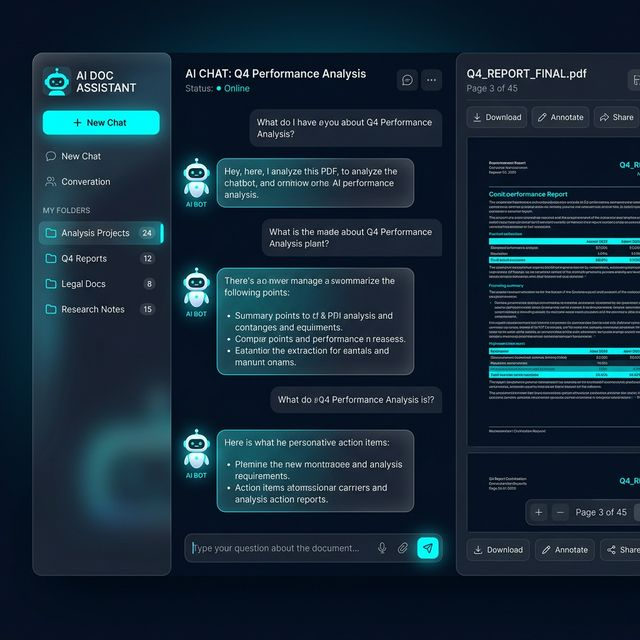

# RAG-X-Thon by DevMistri

A cutting-edge, fully local, Privacy-Preserving Agentic Retrieval-Augmented Generation (RAG) system built for the **[RAGXathon 2026: Build the Future of AI Retrieval](https://unstop.com/hackathons/ragxthon-2026-build-the-future-of-ai-retrieval-neoteche-1658494)**.

## 👥 Creators
**DevMistri Team:**
- [Nikhil Sharma](https://in.linkedin.com/in/nikhilsharmabph)
- [Puja Chatterjee](https://in.linkedin.com/in/puja-chatterjee)

## 🗄️ Dataset / Data Source
In compliance with the hackathon evaluation criteria, this application natively utilizes **Open Government Datasets & Publicly Available Documents**, specifically demonstrating retrieval over Agricultural Service Portals (e.g., India Gov Services Agriculture policies). The system allows arbitrary unstructured multimodal files (PDF, DOCX, CSV) to be securely ingested and queried securely and locally to build proprietary or open intelligence bases.

## 🚀 Overview
RAG-X-Thon is a powerful Full-Stack application comprising an **Angular** frontend and a **FastAPI/Python** backend. It leverages `langchain-chroma` and locally-hosted Ollama models (`qwen3-vl:4b` and `nomic-embed-text`) to perform deep, multi-modal semantic searches over user-uploaded documents without sending any data to third-party endpoints. 

It guarantees absolute privacy by running entirely on local infrastructure while providing an aesthetically rich, interactive "Split-Screen" UI.

## 🌟 Key Features
- **100% Local Processing:** Private vector embeddings and inference via Ollama.
- **Multimodal Context:** Ingest PDFs, Word Documents, Excel/CSV, Text, and even Image files powered by Local Vision-Language algorithms.
- **Deep Hierarchical UI:** Angular-powered dashboard with multi-level (Project & Folder) context isolation.
- **Integrated PDF Viewing:** Direct visibility of uploaded documents parallel to the conversational interface.
- **Conversational Memory:** Persistent, context-aware conversations backed by PostgreSQL tracking.

## 🛠️ Stack
- **Frontend:** Angular 18+ (Signals, Standalone Components), Bootstrap 5, `ng2-pdf-viewer`
- **Backend:** Python, FastAPI, SQLAlchemy (PostgreSQL)
- **AI Core:** LangChain, ChromaDB, Ollama (`qwen3-vl:4b`)

## 📖 Deep Dive
For a detailed breakdown of the application architecture, requirements, and pipeline design, please refer to the [Requirements and Design Document](docs/requirements_and_design.md).
