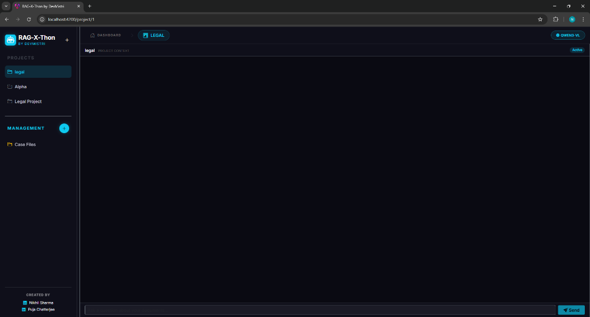
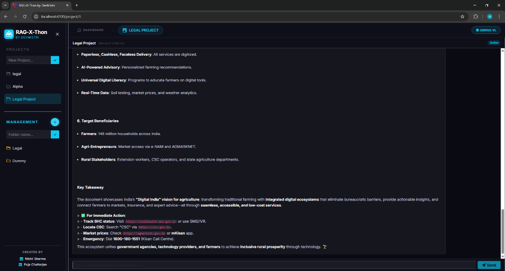
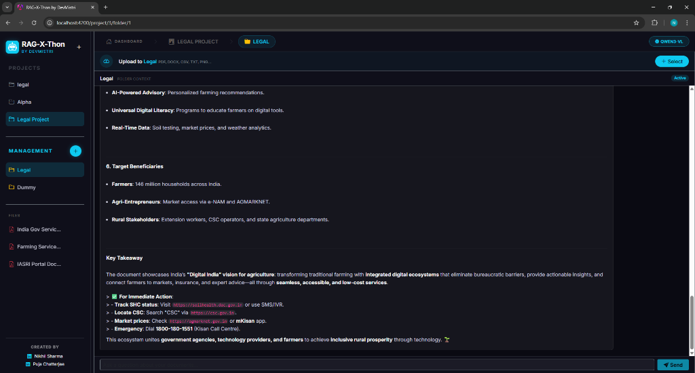
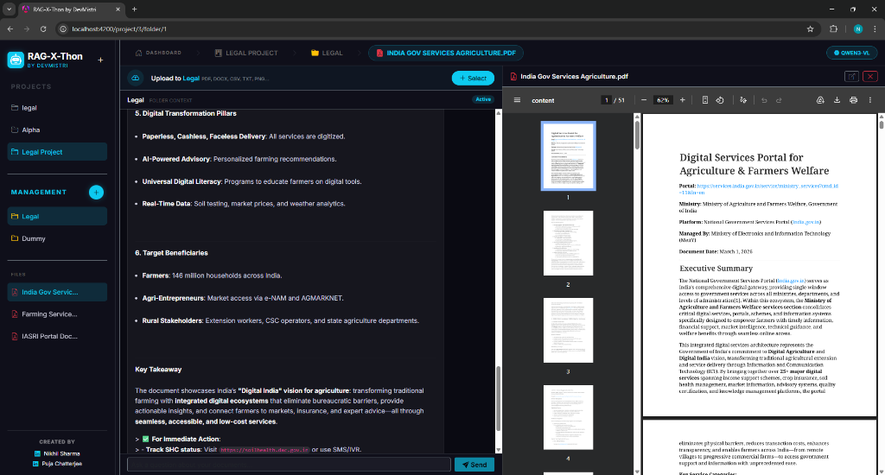

# RAG-X-Thon: Application Demonstration & Walkthrough

Welcome to the visual walkthrough of the **RAG-X-Thon** application. This document illustrates the end-to-end behavior of the system, highlighting the user interface and interactions.

## 1. Dashboard & Project Hierarchy
Upon launching the application (`http://localhost:4200`), users are greeted by the Dashboard. The application is strictly segmented to ensure conversational privacy.

**Creating a Project & Folder:**
- Users dynamically create overarching **Projects** (e.g., "Legal Due Diligence").
- Inside a Project, users instantiate **Folders** (e.g., "Non-Disclosure Agreements").
- *The chat model's vector boundary dynamically locks to the selected folder, guaranteeing answers are explicitly grounded in the active context.*

## 2. Multi-Modal Document Ingestion
Once a folder is selected, the left-hand column unveils the upload utility. 
Users can drop PDFs, Word Documents, Excel sheets, and Scanned Images directly into the UI.
- **Behind the scenes:** FastAPI catches the payload, segments it, utilizes local `nomic-embed-text` to generate vector embeddings, and stores them in ChromaDB. 

## 3. AI Conversational Interface
After ingestion, users engage the AI via the chat bar at the bottom left. 
The chat features instantaneous streaming of the response from local `qwen3-vl:4b`.

## 4. UI Gallery & Evidence
The following screenshots demonstrate the application's clean styling, functional hierarchy, interactive chat, and split-screen document verification system built for instantaneous factual cross-referencing:

---

## 🎥 Playback Video Demonstration
The following video demonstrates the complete application flow, showing exactly how fast local embeddings and streaming inference perform over private documents:

[**▶️ Watch the Full RAG-X-Thon Demo Video Here**](YOUR_YOUTUBE_OR_DRIVE_LINK_HERE)

*(Alternatively, you can embed an MP4 directly via relative markdown if hosting in the repo: `<video src="videos/demo_playback.mp4" controls></video>`)*
