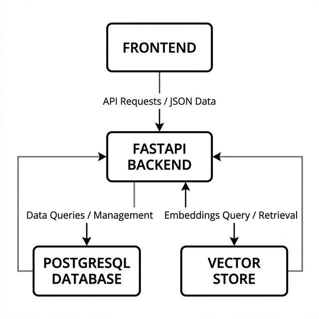
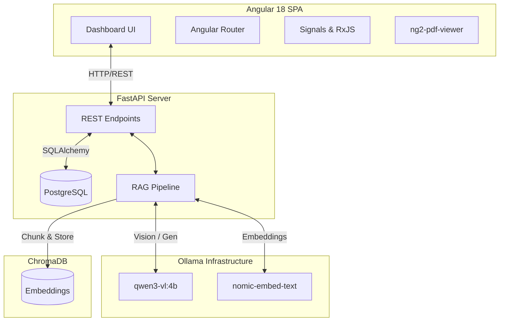
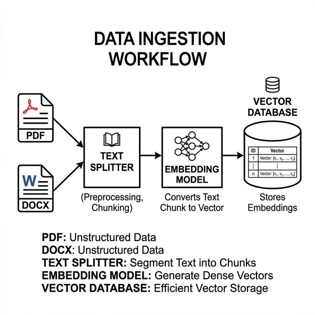
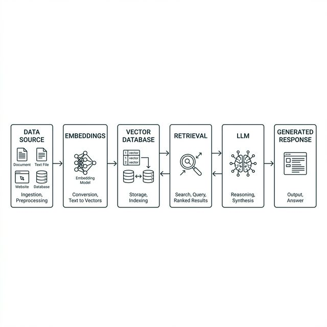
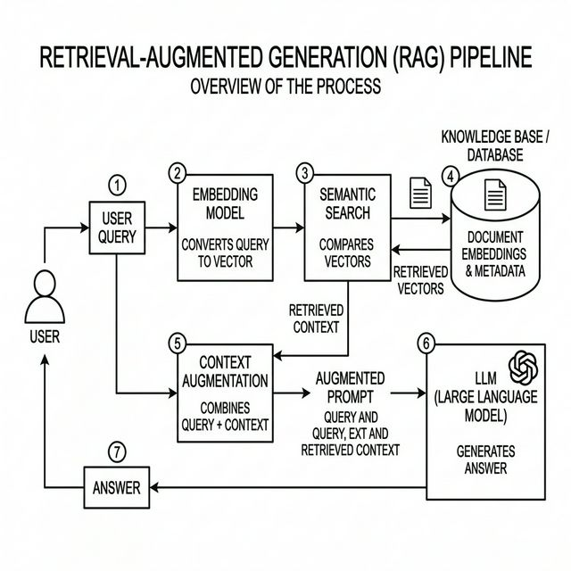

# RAG-X-Thon: Architecture, Design, and Requirements

## 1. Problem Statement
In an era dominated by cloud-based Large Language Models (LLMs), organizations face a critical dilemma: **How to extract intelligent insights from highly sensitive, proprietary, or classified documents without compromising data privacy?** 

Sending confidential data (such as legal contracts, financial CSVs, internal HR policies, or proprietary diagrams) to third-party APIs (OpenAI, Anthropic, etc.) exposes organizations to severe security compliance risks, data leaks, and strict vendor lock-in. Furthermore, traditional search mechanisms fail to understand the semantic meaning of complex queries, and standard text-based RAG solutions fail when presented with multi-modal documents containing charts, graphs, or scanned images.

## 2. Proposed Solution
**RAG-X-Thon** is a cutting-edge, 100% local, Privacy-Preserving Agentic Retrieval-Augmented Generation (RAG) ecosystem. 

Powered by **Ollama**, **FastAPI**, and **Angular 18**, RAG-X-Thon completely eliminates the need for external API calls by running LLM inference and high-dimensional vector embeddings natively on local hardware. It bridges the gap between raw data storage and interactive AI by seamlessly ingesting hierarchical multi-modal data (PDFs, Word, PPTs, Excel, and Images) into a visually stunning, split-pane analytical UI.

## 3. Requirements

### 3.1 Functional Requirements
- **Multi-Modal Ingestion Pipeline:** The system must natively ingest and analyze `.txt`, `.md`, `.pdf`, `.docx`, `.csv`, `.jpg`, and `.png` formats.
- **Vision-Language Processing:** Scanned images or visual payloads must be processed for OCR and semantic descriptions locally.
- **Hierarchical Context Scoping:** Users must be able to organize data into isolated `Projects` and nested `Folders`. Contextual semantic search must be bounded exclusively to the user's active node selection.
- **Conversational AI with Memory:** The chat interface must support natural, multi-turn dialogue, remembering previous prompts utilizing a robust session-based memory architecture.
- **Split-Screen Verification:** The UI must display the parsed PDF/Document directly alongside the AI chat for real-time human verification of the AI's claims.

### 3.2 Non-Functional Requirements
- **Absolute Data Privacy:** Zero outward data transmission. Embeddings and generative inference must occur physically on the host machine.
- **Performance & Reactivity:** The UI must instantly reflect state changes (folder creation, file deletion, navigation) without full page reloads.
- **Extensibility:** The backend architecture must support future drop-in replacements for different embedding models and localized LLMs.

## 4. System Architecture & Design

RAG-X-Thon adopts a decoupled, microservice-inspired architecture separating the frontend SPA client from the heavy ML inference engine.

### 4.1 Backend Engine (FastAPI + LangChain + Chroma)

- **Relational Metadata (`PostgreSQL`):** Tracks relationships between Projects, Folders, Files, Chat Sessions, and distinct Messages using SQLAlchemy ORM.
- **Vector Space (`ChromaDB`):** Utilizes `langchain-chroma` for local, disk-persistent vector storage.
- **Parsing Tier:** 
  - `PyMuPDF` extracts highly accurate text from PDFs.
  - `python-docx` / `python-pptx` / `pandas` natively parses Office and Data files.
  - Image payloads are offloaded to **Ollama** running `qwen3-vl:4b` to harvest rich textual descriptions of raw pixels.
- **Agentic Chains:** LangChain implements the `create_retrieval_chain` intertwined with a `create_history_aware_retriever` to synthesize answers based entirely on injected, chunked context vectors.

### 4.2 Frontend Client (Angular 18+ & Bootstrap 5)
- **Routing & Deep Linking:** Employs the Angular `RouterModule` to bind the application's visual state to the URL (`/project/:id/folder/:id`), allowing users to bookmark and share specific contexts.
- **Reactive State (`Signals`):** Upgraded from traditional RxJS BehaviorSubjects to Angular's bleeding-edge `Signals` for pinpoint, glitch-free DOM updates during navigation and chat generation.
- **Aesthetic Design:** Built on a Neo-Glassmorphism dark theme using highly customized Vanilla CSS and Bootstrap 5 utilities to look premium and dynamic.

## 5. End-to-End RAG Flow

The architecture explicitly maps to the following end-to-end data pipeline to ensure high-fidelity, hallucination-free generation:

### Pipeline Component Breakdown
1. **Data Source:** Raw hierarchical, multi-modal documents (PDF, DOCX, CSV, JPG/PNG) are securely ingested from the user's isolated `Folders` and `Projects`.
2. **Embeddings:** The local `nomic-embed-text` neural network converts the recursively split document text chunks into high-dimensional vector representations.
3. **Vector Database:** These vectors are pushed into local `ChromaDB` collections, structurally segregated and bounded by their folder ID.
4. **Retrieval:** When a chat interaction is initiated, a context-aware `LangChain` semantic retriever queries the Chroma vector store for the closest semantic matches to the user's prompt.
5. **LLM:** The retrieved context chunks and the user's prompt are bundled and injected into the local `qwen3-vl:4b` Generative AI model via Ollama.
6. **Generated Response:** The LLM produces a grounded, structurally sound response based *only* on the retrieved context, which streams back natively to the Angular UI.

## 6. Application Behavior Flow

1. **Hierarchy Instantiation:** The user begins by creating a `Project` (e.g., "Legal Case Alpha") and subdividing it into `Folders` (e.g., "Depositions", "Contracts").
2. **Contextual Ingestion:** The user selects a specific Folder and uploads a multimodal payload. 
3. **ETL Processing:** The FastAPI backend securely chunks the file text recursively, passes it to the local `nomic-embed-text` engine, and inserts the generated vectors into the Chroma collection bound to that Folder ID.
4. **Interactive Querying:** The user initiates the Chat. 
   - *Query Context Boundary:* The retriever filters Chroma strictly for vectors attached to the active `project_id` or `folder_id`.
   - *History Recall:* Historical session messages are retrieved from Postgres to adapt the prompt.
5. **Generative Verification:** The local `qwen3-vl` model streams a detailed response. Simultaneously, the user clicks the referenced visual artifact in the sidebar, seamlessly loading the original document in the right-hand `pdf-viewer` to verify the AI's claims.

## 7. Demo Submission
> **Note to self before submission:** Insert the link to your demo video here and replace the placeholder screenshot with a real UI capture!
- **Demo Video:** `[Link to YouTube/MP4 Here]`
- **App Screenshots:** 
  - 
